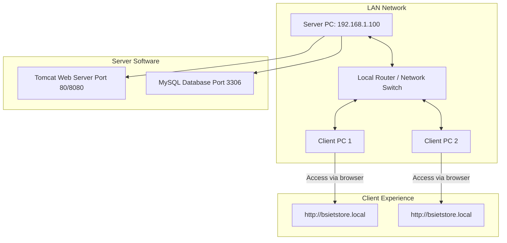

# Store Management System: Complete Server Deployment Guide
This guide will walk you through the process of building the installer, deploying the LAN server, and connecting client computers. 

---

## 🗺️ High-Level Network Architecture
Below is how the system connects computers on your local network:

---

## 🛠️ Step 1: Prepare & Compile the Installer (On Developer's PC)
Follow these steps to package the web portal, database files, and automation scripts into a single installer executable (`StoreManagementSetup.exe`).

### A. Install Inno Setup
Inno Setup is the tool that wraps everything into a single `.exe` file.
1. Download **Inno Setup 6 (Stable)** from the [Inno Setup Downloads page](https://jrsoftware.org/isdl.php).
2. Install it on your computer using the default settings.

### B. Gather the Software Dependency Files
To make the installer work on servers with **no internet access**, download the following 4 files on your computer:

| Software | Package to Download | Official Download Link | Rename File to... |
| :--- | :--- | :--- | :--- |
| **Java JDK 25** | Windows x64 MSI Installer | [Adoptium Temurin 25](https://adoptium.net/temurin/releases/?version=25) | `openjdk25.msi` |
| **Apache Tomcat 9** | Core Windows x64 ZIP | [Apache Tomcat 9.0.89](https://archive.apache.org/dist/tomcat/tomcat-9/v9.0.89/bin/apache-tomcat-9.0.89-windows-x64.zip) | `tomcat9.zip` |
| **MySQL Server 8** | Windows x64 ZIP Archive | [MySQL Community Server 8.0.36](https://downloads.mysql.com/archives/get/p/23/file/mysql-8.0.36-winx64.zip) | `mysql8.zip` |
| **Apache Maven** | Binary ZIP Archive | [Apache Maven 3.9.6](https://archive.apache.org/dist/maven/maven-3/3.9.6/binaries/apache-maven-3.9.6-bin.zip) | `maven.zip` |

Place all 4 renamed files into the **`StoreManagementSetup\redist\`** directory of your workspace.

### C. Compile the Installer
1. Open the **Inno Setup Compiler** application.
2. Select **Open an existing script file** and select the `StoreManagementSetup.iss` file located inside the `StoreManagementSetup` folder of your project.
3. Press **Ctrl + F9** (or go to the top menu and select **Build** -> **Compile**).
4. Wait for the compiler to finish compressing the files. Once done, a new file named **`StoreManagementSetup.exe`** will appear inside the `StoreManagementSetup\` folder.

---

## 🖥️ Step 2: Install the Server Stack (On the Target Server PC)
Follow these steps on the computer that will act as the network server.

### A. Run the Installer
1. Copy **`StoreManagementSetup.exe`** to the Server PC using a USB drive or local network share.
2. Right-click **`StoreManagementSetup.exe`** and select **Run as administrator** (Crucial for service creation).
3. Click **Next** on the welcome screen.
4. **Choose Destination Folder**: Keep the default `C:\StoreManagementWebApp` path. Click **Next**.
5. **Static IP Configuration**:
   * *Check the box* next to: *"Yes, configure static IP address (IP: 192.168.1.100, Gateway: 192.168.1.1, DNS: 8.8.8.8)"* if this computer doesn't already have a static IP set up. This assigns the fixed address recommended in the manual.
   * Click **Next**.
6. **Server Config settings**:
   * Review the pre-configured parameters (Default database password: `root123`, Tomcat Port: `80`, Domain: `bsietstore.local`). Keep defaults for portless URL access.
   * Click **Next**, then click **Install**.
7. **Watch the automation run**: The installer will automatically configure Java, set up the MySQL Database, compile the web portal, deploy the files, write firewall open rules, and start the services.
8. Click **Finish** once done.

### B. Verify local operation on Server
Open a browser on the Server PC and go to:
* **`http://localhost`** or **`http://bsietstore.local`**
If the login page loads, the server is running correctly.

---

## 🔌 Step 3: Connect Client Computers (On LAN Client PCs)
Follow these steps on the other computers connected to the same local network.

### A. Ensure LAN Connection
Make sure the client computers are connected to the same network (Wi-Fi or LAN cable) as the Server PC.

### B. Map the Local Domain
1. On the Server PC, navigate to `C:\StoreManagementWebApp\client_setup\`.
2. Copy the file **`configure_client_hosts.ps1`** to a USB flash drive.
3. Paste the file onto the Desktop of the Client PC.
4. Right-click **`configure_client_hosts.ps1`** on the client PC and select **Run with PowerShell**.
5. Click **Yes** when prompted to run as administrator. A console window will pop up, automatically register the server's IP address, and close.

### C. Access the Portal
Open Google Chrome or Microsoft Edge on the client PC and navigate to:
* **`http://bsietstore.local`** (or `http://192.168.1.100`)

---

## 🔑 Step 4: Login & Test Credentials
Once the login screen loads, use the following roles for verification:

| Role Name | Username | Password | Access Level |
| :--- | :--- | :--- | :--- |
| **Administrator** | `admin` | `admin123` | Full access to users, settings, and database tables. |
| **Store Manager** | `store` | `store123` | Add inventory, upload invoices, issue items to departments. |
| **Director / Principal** | `director` | `director123` | Approve requirements, review payments, download PDF reports. |
| **Department User** | `deptuser` | `user123` | Request requirements and confirm item delivery. |

---

## ❓ Troubleshooting & FAQs

#### 1. The database shows a connection error:
* Check if the MySQL service is running. Open **Services** on Windows (search for `services.msc`), find **MySQL80**, and ensure its status is **Running**.

#### 2. The client PC cannot connect to the server:
* Ensure both the server and client PCs are connected to the same router network.
* Make sure you ran the `configure_client_hosts.ps1` file as Administrator on the client PC.
* Verify that Windows Defender Firewall on the Server PC is not blocking incoming traffic (the installer attempts to open ports `80`, `8080`, and `3306` automatically).

#### 3. Uploading scanned files fails:
* Ensure the directories inside `C:\Tomcat9\webapps\ROOT\uploads\` exist. The installer creates them automatically during setup and applies full write privileges.
